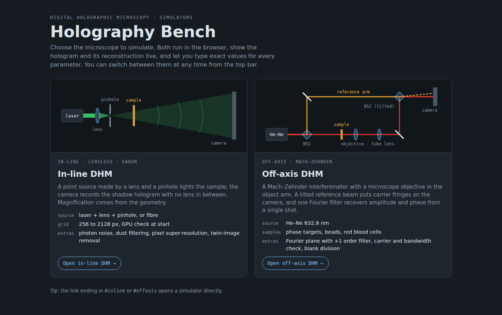
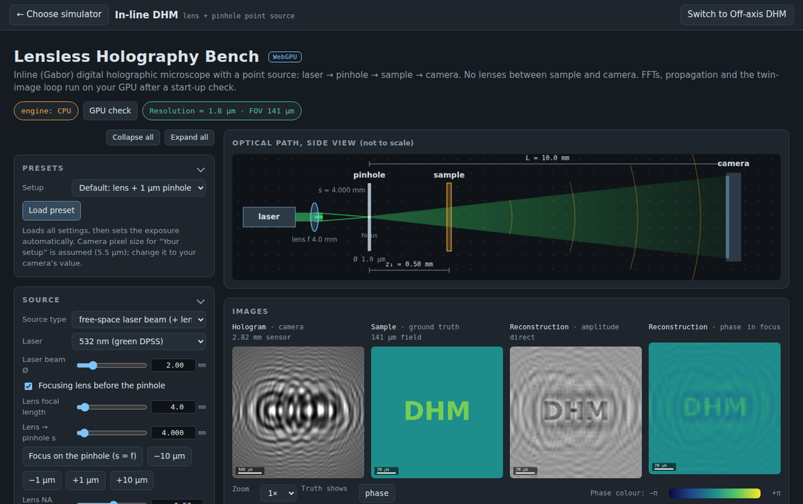
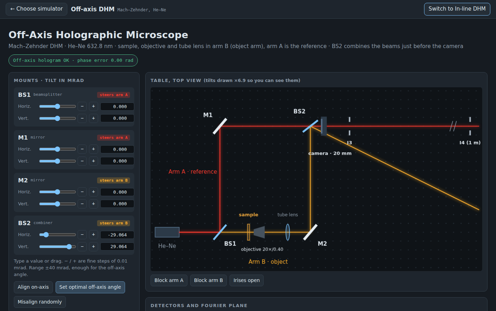
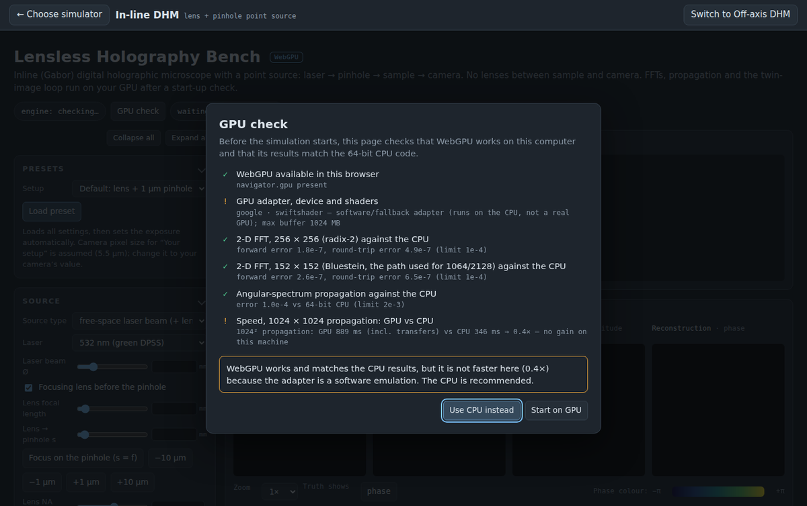

# Holography Bench

Interactive simulators for **digital holographic microscopy (DHM)** that run entirely in the browser:

| | **In-line DHM** (lensless, Gabor) | **Off-axis DHM** (Mach–Zehnder) |
|---|---|---|
| Source | laser + focusing lens + pinhole, or single-mode fibre | He–Ne 632.8 nm |
| Optics | none between sample and camera; magnification M = L / z₁ | microscope objective + tube lens in the object arm, tilted reference |
| Reconstruction | back-propagation, illumination division, iterative twin-image removal | Fourier filtering of the +1 order, blank division |
| Extras | photon budget and noise, dust and spatial filtering, pixel super-resolution, grids up to 2128 px, WebGPU engine with start-up check | carrier and bandwidth check, red blood cells and phase targets, alignment of every mount |



**Live version:** `https://YOUR-USERNAME.github.io/holography-bench/` (after you enable GitHub Pages, see below)

---

## Quick start

No installation is needed.

* **Online:** open the GitHub Pages address above.
* **Offline:** download the repository and double-click `site/index.html`. Chrome or Edge is recommended (WebGPU).

Choose a simulator on the start page. The top bar switches between the two or goes back to the start page; each simulator keeps its settings while you switch.

| In-line DHM | Off-axis DHM |
|---|---|
|  |  |

### GPU check (in-line DHM)

Before the in-line simulator starts, it tests WebGPU on your computer: it compares a 2-D FFT (radix-2 and Bluestein) and a full propagation with the 64-bit CPU code and runs a speed test. You then choose **Start on GPU** or **Use CPU instead**. Both give the same results; the GPU is faster on large grids.



---

## Repository layout

```
site/                  the web app (plain HTML/JS, no build step)
  index.html           start page: choose the simulator
  inline.html          in-line (lensless) DHM simulator, WebGPU + CPU
  offaxis.html         off-axis (Mach–Zehnder) DHM simulator
  manifest.webmanifest, sw.js, icons/   installable web app + offline cache
desktop/               Electron wrapper that packages site/ as a desktop app
python/                stand-alone Mach–Zehnder interferometer simulation (NumPy/Matplotlib)
docs/
  Lens_Pinhole_Holography_Theory.pdf   theory of the lens + pinhole in-line configuration
  theory/              LaTeX source of the PDF and the script that makes its figures
  img/                 screenshots used in this README
.github/workflows/     automatic website deployment and Windows build
```

---

## Publish the website (GitHub Pages)

1. Push this repository to GitHub (or upload the files with **Add file → Upload files**).
2. **Settings → Pages → Build and deployment → Source: GitHub Actions.**
3. The workflow `Deploy website` runs on every push to `main` that changes `site/`. After 1–2 minutes the site is at `https://YOUR-USERNAME.github.io/REPOSITORY-NAME/`.

The site is an installable web app: in Chrome or Edge use the install icon in the address bar. It then opens in its own window and works offline. After changing any file in `site/`, also change `VERSION` in `site/sw.js` so installed copies update.

## Desktop app (Windows, macOS, Linux)

The Windows build runs on GitHub's servers:

* **Actions → Build desktop app → Run workflow.** The zip appears under the run's *Artifacts*.
* Pushing a tag such as `v1.1.0` also attaches the zip to a GitHub Release.

To build or run it yourself (Node.js 20 or newer):

```bash
cd desktop
npm ci
npm start              # run the app
npm run package:win    # or package:mac / package:linux -> desktop/dist/
```

The app is not code-signed, so Windows SmartScreen asks for confirmation on first launch (*More info → Run anyway*).

## Python simulation

```bash
cd python
pip install -r requirements.txt
python mach_zehnder_sim.py
```

## Theory

[`docs/Lens_Pinhole_Holography_Theory.pdf`](docs/Lens_Pinhole_Holography_Theory.pdf) derives every quantity of the in-line simulator for the lens + pinhole source: focusing and working NA, pinhole transmission and regimes, the radial diffraction integral for the illumination, spatial filtering, Fresnel scaling, band-limited angular-spectrum propagation, the camera and photon model, reconstruction and twin-image removal, and the resolution limits, with a worked example that matches the simulator's numbers.

To rebuild it:

```bash
cd docs/theory/figs && python make_figs.py     # needs numpy, scipy, matplotlib
cd .. && pdflatex lens_pinhole_theory.tex && pdflatex lens_pinhole_theory.tex
```

## Model in brief

* Scalar diffraction; band-limited angular-spectrum propagation (Matsushima & Shimobaba 2009).
* In-line: Fresnel scaling theorem for the spherical-wave geometry; illumination from a radial Hankel integral over the pinhole; Poisson and read noise, full well and bit depth; Gerchberg–Saxton-type twin-image removal with phase or absorption constraints.
* Off-axis: interference of object and tilted reference waves on the camera; +1-order filtering in the Fourier plane; blank (sample-free) hologram division.

### Limitations

Thin-sample approximation; perfectly coherent, monochromatic laser; ideal Gaussian beams and aberration-free optics; simulated sensors of at most 2128 × 2128 pixels; WebGPU uses 32-bit floats (the CPU path uses 64-bit). The simulators are teaching and design tools. They do not replace measurements on a real setup.

## Browser support

The simulators are tested in Chromium (Chrome, Edge, Electron). They use only standard web APIs and should also run in current Firefox and Safari. WebGPU acceleration needs a browser and GPU driver that support it (Chrome and Edge on Windows and macOS are the most reliable). Without it the in-line simulator runs on the CPU.

## Citing

If you use Holography Bench in teaching or research, please cite it as described in [`CITATION.cff`](CITATION.cff) (GitHub shows a *Cite this repository* button).

## License

See [`LICENSE`](LICENSE).
